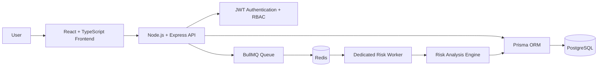
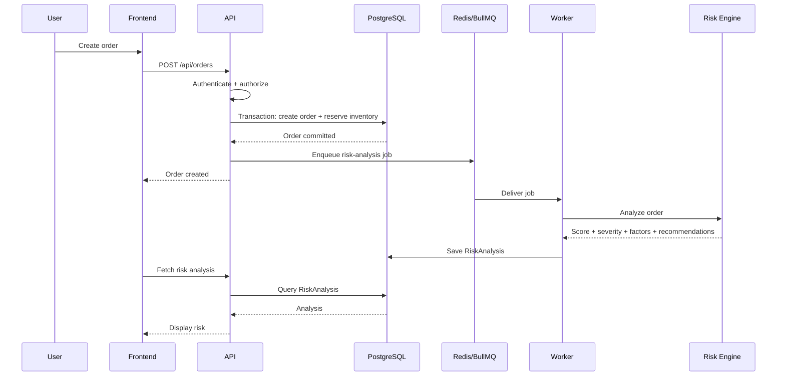

# 🚚 AI-Powered Supply Chain Risk Management

<p align="center">
  <strong>Enterprise-style supply chain control center with asynchronous AI risk analysis.</strong><br/>
  Manage orders, inventory, suppliers, warehouses, shipments, exceptions, and proactively identify order risk.
</p>

<p align="center">
  <a href="https://ai-powered-supply-chain-risk-management-1.onrender.com">
    
  </a>
  <a href="https://github.com/UtkarshRode/ai-powered-supply-chain-risk-management">
    
  </a>
</p>

<p align="center">
  
  
  
  
  
</p>

---

## ✨ Overview

**AI-Powered Supply Chain Risk Management** is a full-stack supply-chain operations platform built around a practical software-engineering problem: **turn operational events into actionable risk signals without blocking the main application.**

It provides a centralized control center for:

- 📦 Orders and order status
- 🏭 Inventory and warehouses
- 🤝 Suppliers and supplier reliability
- 🚛 Shipments and delivery status
- ⚠️ Operational exceptions
- 🤖 Automated order-risk analysis
- 🔐 JWT authentication and role-based access control

The key engineering feature is the **asynchronous risk-analysis pipeline**. When an order is created, the API completes the transactional order operation and publishes a BullMQ job to Redis. A dedicated worker consumes the job, evaluates supply-chain risk, persists the result, and makes the analysis available to the dashboard.

---

## 🎬 Live Demo

### 🌐 Application

**[Launch the live application →](https://ai-powered-supply-chain-risk-management-1.onrender.com)**

### 📦 Source Code

**[View the GitHub repository →](https://github.com/UtkarshRode/ai-powered-supply-chain-risk-management)**

> **Demo flow:** Log in → Orders → select an order → view **AI Risk Analysis**.

---

## 🖥️ Screenshots

Create this directory and place your screenshots inside it:

```text
docs/
└── screenshots/
    ├── dashboard.png
    ├── orders-risk-analysis.png
    ├── inventory.png
    ├── shipments.png
    └── exceptions.png
```

### 📊 Dashboard


### 📦 Orders & AI Risk Analysis


### 🏭 Inventory


### 🚛 Shipments


### ⚠️ Exceptions


---

## 🧠 Core Feature — Asynchronous Risk Analysis

```text
                    ┌─────────────────────┐
                    │   React Frontend    │
                    └──────────┬──────────┘
                               │ POST /api/orders
                               ▼
                    ┌─────────────────────┐
                    │ Express REST API    │
                    │ JWT + RBAC          │
                    └──────────┬──────────┘
                               │
                         DB Transaction
                               ▼
                    ┌─────────────────────┐
                    │ PostgreSQL + Prisma │
                    │ Order + Inventory   │
                    └──────────┬──────────┘
                               │ Queue Job
                               ▼
                    ┌─────────────────────┐
                    │ Redis + BullMQ      │
                    │ risk-analysis queue │
                    └──────────┬──────────┘
                               │
                               ▼
                    ┌─────────────────────┐
                    │ Dedicated Worker    │
                    │ Risk Analysis       │
                    └──────────┬──────────┘
                               │
                               ▼
                    ┌─────────────────────┐
                    │ RiskAnalysis table  │
                    │ score / severity    │
                    │ factors / actions   │
                    └──────────┬──────────┘
                               │
                               ▼
                    ┌─────────────────────┐
                    │ Dashboard           │
                    │ AI Risk Analysis    │
                    └─────────────────────┘
```

### Why asynchronous processing?

Risk analysis is moved out of the synchronous order request:

```text
Create Order → Queue Job → Return
                       ↓
                 Worker analyzes
                       ↓
                  Save result
```

This keeps the API responsive and allows the background workload to use independent retries.

---

## 🏗️ Architecture



---

## 🔥 Order → Risk Pipeline



---

## 🔐 Authentication & Authorization

- JWT-based authentication
- Protected API routes
- Role-based access control
- `ADMIN`
- `MANAGER`
- `ANALYST`

Sensitive operations are protected at the route/middleware layer.

---

## 📦 Order Management

Orders support:

- Customer association
- Multiple order items
- Product pricing
- Total calculation
- Promised delivery dates
- Status lifecycle
- Shipment association
- Exception association
- Risk-analysis history

Order states include:

```text
PENDING → CONFIRMED → PROCESSING → SHIPPED → DELIVERED
```

Cancellation is also supported.

---

## 🏭 Inventory Reservation

During order creation, availability is checked using:

```text
available = quantity - reserved
```

If the requested quantity exceeds available stock, the order is rejected.

Order creation and inventory reservation are handled inside a **Prisma database transaction**, preventing partial order creation.

---

## 🤖 Risk Analysis

The risk engine produces:

```text
Risk Score
Severity
Risk Factors
Recommendations
```

Example verified production result:

```text
Risk Score: 50 / 100
Severity:   MEDIUM

Factors:
• Low inventory for the ordered product
• No shipment associated with the order

Recommendations:
• Replenish inventory
• Create or assign a shipment
```

The result is persisted in the `RiskAnalysis` table and displayed in the dashboard.

---

## 🗄️ Data Model

```text
User
 ├── Orders
 └── Exceptions

Customer
 └── Orders

Product
 ├── Inventory
 ├── OrderItems
 └── SupplierProducts

Supplier
 ├── SupplierProducts
 └── Shipments

Warehouse
 └── Inventory

Order
 ├── OrderItems
 ├── Shipments
 ├── Exceptions
 └── RiskAnalyses
```

---

## ⚙️ Tech Stack

| Layer | Technology |
|---|---|
| Frontend | React, TypeScript, Vite |
| Backend | Node.js, Express, TypeScript |
| Authentication | JWT, bcrypt |
| Database | PostgreSQL |
| ORM | Prisma |
| Queue | BullMQ |
| Broker | Redis |
| Background Processing | Dedicated Node.js Worker |
| Validation | Zod |
| Security | Helmet, CORS |
| Logging | Morgan |
| Deployment | Render |

---

## 📁 Project Structure

```text
AI_Supply_Chain/
│
├── client/
│   ├── src/
│   ├── public/
│   └── package.json
│
├── server/
│   ├── prisma/
│   │   ├── schema.prisma
│   │   └── migrations/
│   ├── src/
│   │   ├── config/
│   │   ├── controllers/
│   │   ├── middleware/
│   │   ├── queues/
│   │   ├── routes/
│   │   ├── services/
│   │   ├── types/
│   │   └── server.ts
│   └── package.json
│
└── worker/
    ├── src/
    │   ├── workers/
    │   ├── services/
    │   └── index.ts
    └── package.json
```

---

## 🛠️ Local Development

### Prerequisites

- Node.js
- npm
- PostgreSQL
- Redis

### Clone

```bash
git clone https://github.com/UtkarshRode/ai-powered-supply-chain-risk-management.git
cd ai-powered-supply-chain-risk-management
```

### Install dependencies

```bash
cd client
npm install

cd ../server
npm install

cd ../worker
npm install
```

### Environment variables

Create environment files for the backend and worker.

Typical variables:

```env
DATABASE_URL=your_postgresql_connection_string
REDIS_URL=your_redis_connection_string
JWT_SECRET=your_jwt_secret
PORT=10000
```

> Never commit real credentials, tokens, database URLs, or production secrets.

### Database

From `server/`:

```bash
npx prisma generate
npx prisma migrate deploy
```

### Run services

Frontend:

```bash
cd client
npm run dev
```

Backend:

```bash
cd server
npm run dev
```

Worker:

```bash
cd worker
npm run dev
```

---

## 🧪 Reliability

The background queue is configured with:

```text
Attempts: 3
Backoff: exponential
Initial delay: 2000 ms
```

This allows transient processing failures to be retried.

Completed analyses are persisted in PostgreSQL so the dashboard can display analysis history.

---

## 🚀 Deployment

```text
┌────────────────────────────────────────────────┐
│                    Render                      │
│                                                │
│  Frontend ────────────────► Web Application    │
│  Backend ─────────────────► REST API          │
│  Worker ──────────────────► Risk Processing   │
└───────────────┬────────────────┬───────────────┘
                │                │
                ▼                ▼
          PostgreSQL           Redis
```

The production backend starts with:

```bash
npx prisma migrate deploy && node dist/server.js
```

so committed Prisma migrations are applied during future deployments.

---

## 🔒 Security Notes

- Passwords are stored as hashes rather than plaintext.
- API routes are protected using JWT authentication.
- Role-based authorization protects sensitive operations.
- Production secrets are supplied through environment variables.
- `.env` files should never be committed.
- Demo credentials should not be reused for production accounts.

---

## 📌 Engineering Highlights

This project demonstrates practical SDE concepts:

- **Layered backend architecture**
- **REST API design**
- **JWT authentication**
- **RBAC authorization**
- **Relational database modeling**
- **Database transactions**
- **Inventory consistency**
- **Asynchronous job processing**
- **Redis-backed queues**
- **Dedicated worker architecture**
- **Retry + exponential backoff**
- **Persistent risk-analysis history**
- **Database migrations**
- **Production deployment**

---

## 🎯 Why This Project?

Traditional supply-chain dashboards expose operational data but often do not help users identify **which orders require attention first**.

This project adds an operational intelligence layer:

> **Operational event → Risk assessment → Actionable recommendation**

---

## 📈 Future Improvements

- [ ] Idempotent risk-job processing
- [ ] More advanced predictive ML models
- [ ] Real-time dashboard updates using Socket.IO
- [ ] Automated test suite
- [ ] CI/CD pipeline
- [ ] Observability and structured logging
- [ ] Rate limiting
- [ ] Advanced supplier forecasting
- [ ] Demand prediction
- [ ] Multi-warehouse optimization
- [ ] Critical-risk notifications

---

## 👨‍💻 Author

**Utkarsh Rode**

Built as an end-to-end software engineering project focused on **backend architecture, distributed processing, database design, and AI-assisted operational intelligence**.

<p align="center">
  <strong>Built with React • Node.js • PostgreSQL • Redis • BullMQ • Prisma</strong>
</p>
